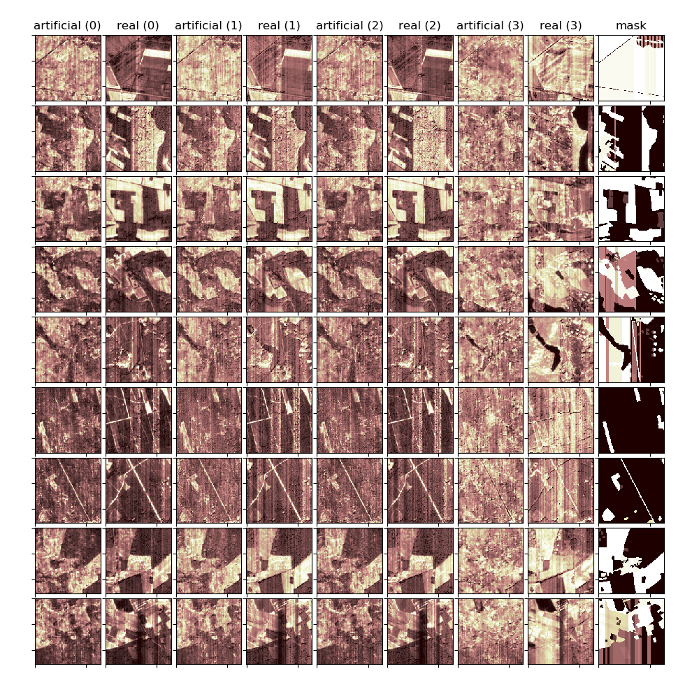
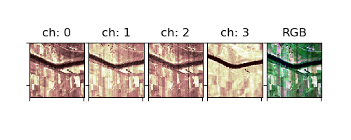

# Sentinel cGAN



Data argumentation facility used during [modifiable areal](https://en.wikipedia.org/wiki/Modifiable_areal_unit_problem) unit problem research project. Read more in our article on Medium - [Generative adversarial networks in satellite image datasets augmentation.]()

## Usage

### Data
Sample data can be downloaded from our [S3](https://sml-ml-data-sets.s3.eu-central-1.amazonaws.com/sentinel-cgan/bdot.tar.gz) bucket or by utilizing the `scgan/data_download.py`. 

To produce you own data you can use `scgan/gdal_operations.py`. Please note that three files will be needed: TIFF representing land cover, TIFF with satellite image and generate grid in form of an ArcGis shape file.

Dataset has to meet following criteria in terms of the directory structure:

```
dataset (name of the dataset)
├── train (samples used during training)
│   ├── data_descriptor.csv (names / ids of the files)
│   ├── LC (land cover data folder)
│   │   ├── LC_10.tif
│   │   ├── LC_1.tif
....................
│   │   └── LC_n.tif
│   └── S
│       ├── S_10.tif
│       ├── S_1.tif
....................
│       └── S_n.tif
├── plot (samples used during intermediate result plotting after each epoch)
│   ├── data_descriptor.csv (names / ids of the files)
│   ├── LC (land cover data folder)
│   │   ├── LC_10.tif
│   │   ├── LC_1.tif
....................
│   │   └── LC_n.tif
│   └── S
│       ├── S_10.tif
│       ├── S_1.tif
....................
│       └── S_n.tif
└── test (samples used during predict phase)
    ├── data_descriptor.csv (names / ids of the files)
    ├── LC (land cover data folder)
    │   ├── LC_10.tif
    │   ├── LC_1.tif
....................
    │   └── LC_n.tif
    └── S
        ├── S_10.tif
....................
        └── S_1.tif
```

### Train

The default training configuration can be run from `scgan/train.py`. Default dataset is called `bdot`. Please note that chosen hyperparameters were set for the training to perform best on the sample dataset related to central Poland and Sentinel-2 images.

### Predict

To generate artificial satellite images from predefined mask use `scgan/predict`. If you did not train a model you can download one of ours from [S3](https://sml-ml-data-sets.s3.eu-central-1.amazonaws.com/sentinel-cgan/generator.h5). Masks have to placed in relevant dataset `test` subdirectory.



# References
1. [Original Pix2Pix paper](https://arxiv.org/abs/1611.07004)
1. [Tips on training GAN](https://medium.com/@utk.is.here/keep-calm-and-train-a-gan-pitfalls-and-tips-on-training-generative-adversarial-networks-edd529764aa9)
1. [Reference implementation using Keras](https://machinelearningmastery.com/how-to-develop-a-pix2pix-gan-for-image-to-image-translation/)
